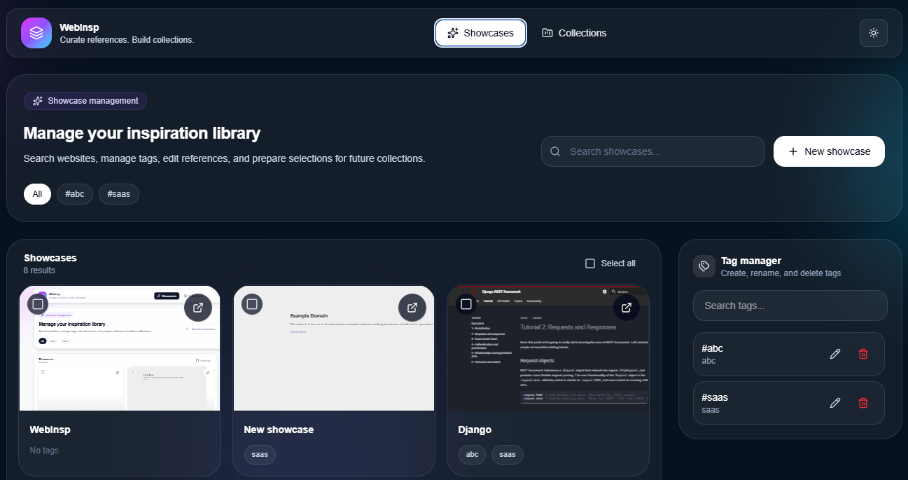
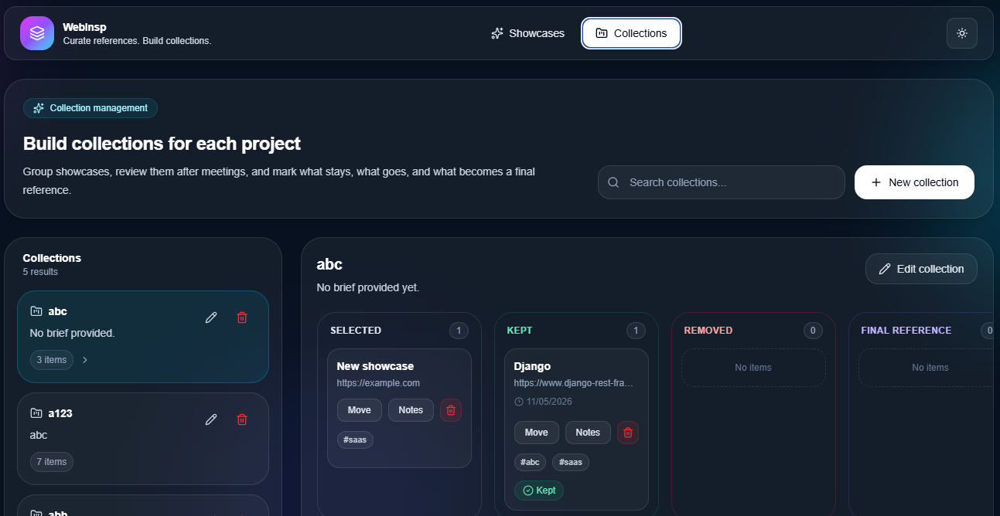

# WebInsp

A small full-stack app for saving website inspiration, tagging showcases, and organizing them into collections.

## Tech stack


## Utility

- Save showcase links with title, description, and tags.
- Browse inspiration in a cleaner showcase UI.
- Open the source website or manage showcase details in a drawer.
- Create collections from selected showcases.
- Add showcases to existing collections.
- Manage tags for organization.

## Requirements

- Node.js
- npm
- Python 3
- pip
- SQLite (used as the local database through Django)

## Run locally

### Backend
```bash
cd backend
python -m venv .venv
source .venv/bin/activate
pip install -r requirements.txt
python manage.py migrate
python manage.py runserver
```

### Frontend
```bash
cd frontend
npm install
npm run dev
```

Frontend runs on Vite and proxies `/api` to the Django backend.

## Screens

### Showcases


### Collections

